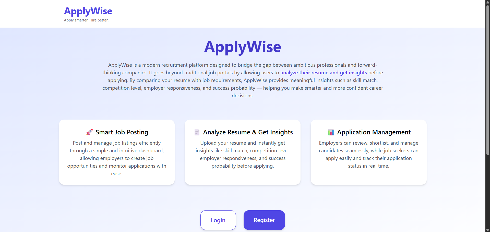
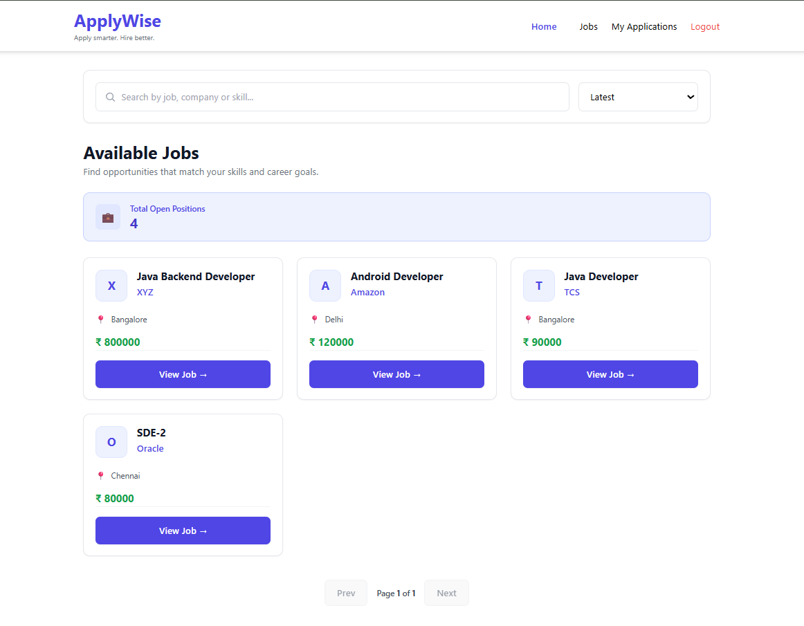
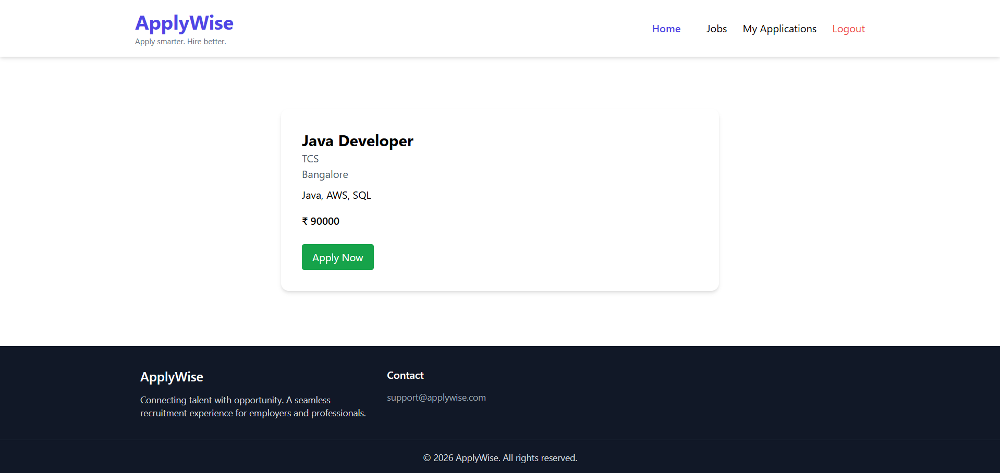
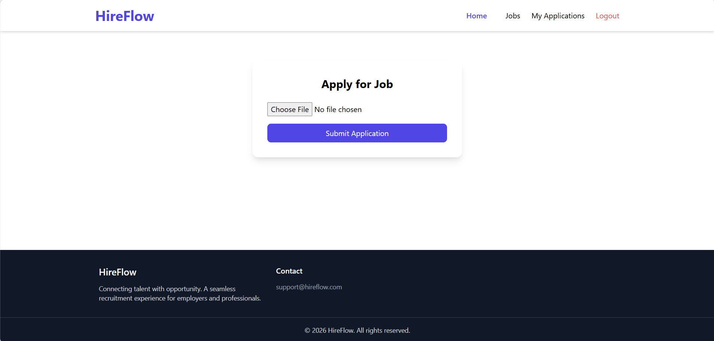
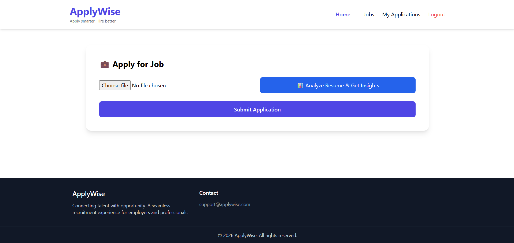
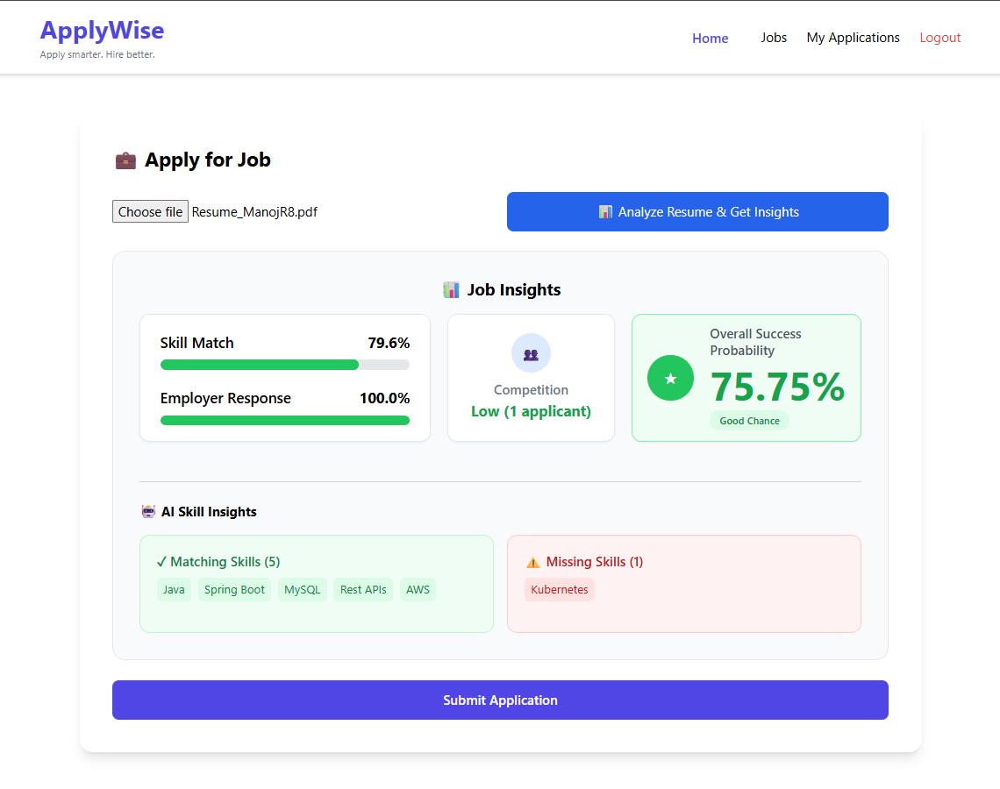
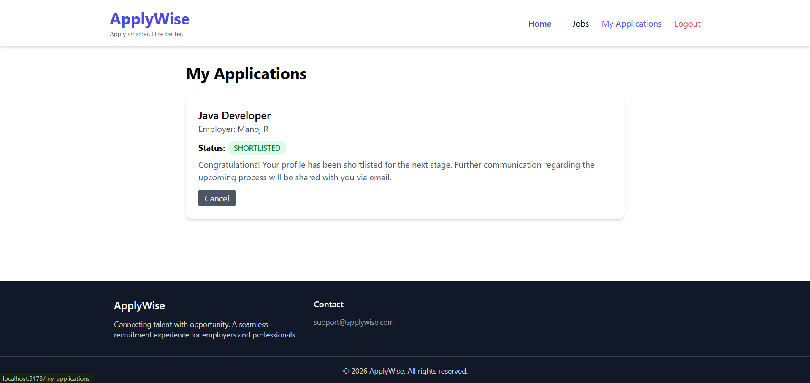
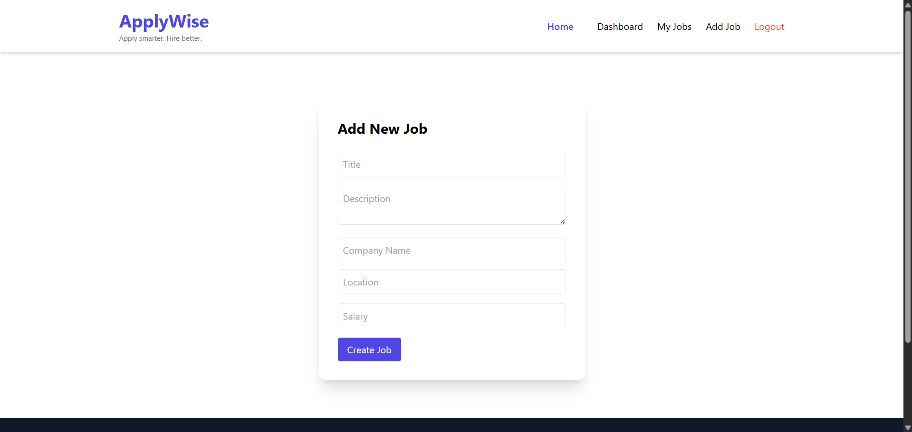
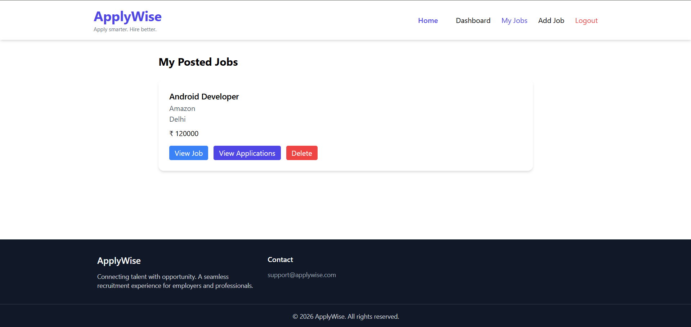
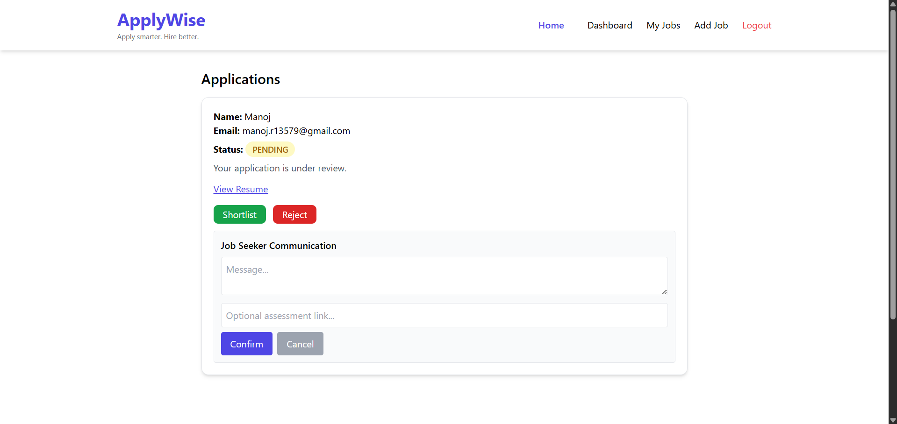

# ApplyWise – Full Stack Recruitment Platform
## ApplyWise is a full-stack recruitment platform that connects job seekers with employers. Employers can post jobs and manage applicants, while job seekers can explore opportunities, analyze their resumes, and apply intelligently. The project demonstrates a modern full-stack architecture with secure authentication, role-based access control, resume uploads, resume-job compatibility analysis, email notifications, and cloud deployment.
---

## 🚀 Live Demo

**Frontend:**
https://hireflow-1-62fu.onrender.com

**Backend API:**
https://hireflow-2sol.onrender.com

---

## 📸 Screenshots

### Home Page


### Job Seeker Interface

#### Job Listings


#### Job Details


#### Apply Job


#### Analyze Resume and Get Insights


#### Job Insights


#### Job Seeker Applications


### Employer Interface

#### Create Job


#### Employer Posted Jobs


#### Employer Job Applications


---

## 🛠 Tech Stack

### Frontend

* React (Vite)
* Tailwind CSS
* Axios
* React Router

### Backend

* Java
* Spring Boot
* Spring Security
* JWT Authentication
* RESTful APIs

### Database

* PostgreSQL

### Deployment

* Docker
* Render (Backend & Database)
* Render (Frontend)

---

## ✨ Features

### Authentication & Authorization

* Secure user registration and login
* JWT based authentication
* Role based access (Employer / Job Seeker)

### Job Management

Employers can:

* Create job postings
* Edit or delete job listings
* View all jobs they posted

### Job Discovery

Job seekers can:

* Browse available jobs
* View detailed job information
* Search and filter jobs

### Resume Analysis & Insights

Analyze resume against job description before applying
Skill match calculation based on required job skills
Competition level based on number of applicants
Employer responsiveness tracking
Success probability estimation for informed decision-making

### Job Applications

Job seekers can:

* Apply to jobs
* Upload resume files
* Analyze resume before applying
* Track application status

Employers can:

* View job applicants
* Access uploaded resumes
* Shortlist or reject candidates
* Trigger email notifications on status updates

### Email Notifications

* Automatic email updates sent to job seekers on application status changes
* Rejection emails with custom messages
* Shortlisting emails with optional assessment links
* Enhances communication between employers and candidates

### File Upload

* Resume upload using `MultipartFile`
* Files served through `/uploads` endpoint

---

## 🔐 Security

* JWT based authentication
* Spring Security configuration
* Protected REST endpoints
* Role-based authorization
* Secure email communication via backend service

---

## ⚙️ Environment Variables

Example environment configuration:

### Frontend

```
VITE_API_URL=<backend-api-url>
VITE_BACKEND_URL=<backend-base-url>
```

### Backend

```
SPRING_DATASOURCE_URL=<database-url>
SPRING_DATASOURCE_USERNAME=<db-username>
SPRING_DATASOURCE_PASSWORD=<db-password>
JWT_SECRET=<jwt-secret>
PORT=<server-port>
```

---

## 🧪 Running Locally

### Backend

```
cd HireFlow-backend
./mvnw spring-boot:run
```

### Frontend

```
cd HireFlow-frontend
npm install
npm run dev
```

---

## 📌 Future Improvements

* Job recommendation system
* Admin dashboard
* Advanced job search filters

---

## 👨‍💻 Author

**Manoj R**

GitHub:
https://github.com/ManojRTech

---

## ⭐ Support

If you found this project useful, consider giving it a star ⭐ on GitHub.

## About
ApplyWise – A full-stack job recruitment platform built with Spring Boot, React (Vite), JWT Authentication, and PostgreSQL. Includes resume analysis, skill matching, competition scoring, employer responsiveness, success prediction, and email notification system for application updates
